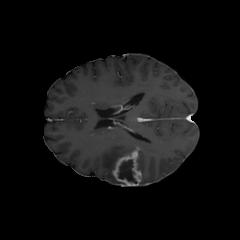
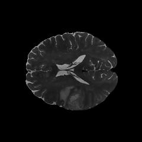

# Tumour Detection and Segmentation from Multi-Sequence 2D Brain MRI Slices (UCSF-PDGM)

|                          |                          |                          |
|------------------------|------------------------|------------------------|
|  |  |  |

## Problem

TODO: About the dataset

1.  Classification:
    -   Detections of tumour in each slice using `is_tumorous`
2.  Segmentation:
    -   Pixel localisation using `tumor_mask`.

## Data Structure

### Dataset

| Field         | Description                                      |
|---------------|--------------------------------------------------|
| `volume_id`   | Unique patient identifier                        |
| `slice_id`    | Index of slice of MRI (155 slices)               |
| `t1`          | 2D Pre-contrast T1 weighted MRI slice            |
| `t1c`         | 2D Post-contrast T1 weighted MRI slice           |
| `t2`          | 2D T2 weighted MRI slice                         |
| `tumor_mask`  | 2D tumor segmentation mask                       |
| `is_tumorous` | Whether any tumour label is present on the slice |
| `tumor_type`  | Final diagnosis                                  |
| `who_grade`   | WHO tumour grade                                 |
| `sex`         | Patient sex M or F                               |
| `age`         | Patient age at MRI                               |

### Tumour mask

| Value | Label      | Description                                       |
|-------|------------|---------------------------------------------------|
| `0`   | Background | No tumour                                         |
| `1`   | NCR/NET    | Necrotic and non-enhancing tumour core            |
| `2`   | ED         | Peritumoral edema / surrounding FLAIR abnormality |
| `4`   | ET         | GD-enhancing tumour                               |

### Tumour Grades

| Tumour Region of Interest | Labels        |
|---------------------------|---------------|
| No Tumour                 | `0`           |
| Whole Tumour              | `1`, `2`, `4` |
| Tumour Core               | `1`, `4`      |
| Enhancing Tumour          | `4`           |

All patients have a confirmed diagnosis, after removing missing values there is 414 patients x 155 slices = 64170 slices. `is_tumorous` varies per slice with 38,715 no tumour slices and 25,455 tumour slices.

[UCSF_PDGM Dataset](https://huggingface.co/datasets/chehablab/UCSF_PDGM) - Hugging Face

## Baseline

To find the baseline accuracy without a model: Logistic regression on flattened pixels (`t1`, `t1c`, `t2`) and patient metadata (`sex`, `age`) to predict `is_tumorous`.

TODO: Baseline Model Structure

## Metric

-   Classification: AUC (Area Under Curve)

-   Segmentation: IOU (Intersection Over Union)

## Risk

The primary risk is data leakage at the patient level as each patient has 155 slices, therefore the data must be split by `volume_id` not `slice_id`. `tumor_type` and `who_grade` will be excluded from the model input features as these are consistent across whole patient information rather than on the individual slices.

## Team

Individual.

## AI Tools

I will try use a combination of LLM models including the Ollama qwen3:1.7b and trialing Claude Sonnet 5 depending on the depth of questions or errors encountered.